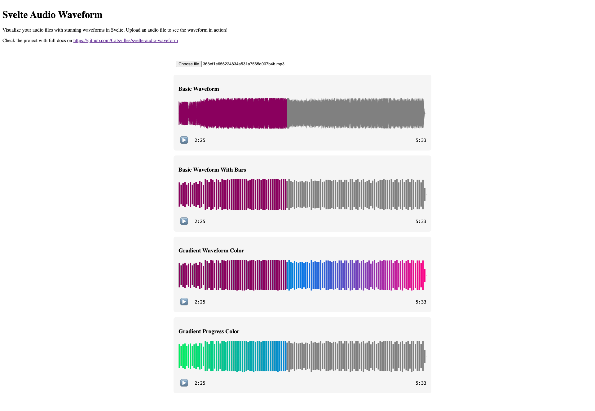

# Svelte Audio Waveform

The fastest way to add stunning audio visualizations to your Svelte apps. Create beautiful, responsive waveform visualizations from audio files with progress indication and customizable styling. Perfect when you need professional-looking audio visualization without the complexity of heavyweight solutions like Wavesurfer.

### Perfect for:
- 🎵 Music players
- 🎙️ Podcast interfaces
- 📞 Voice message previews
- ✂️ Audio editing tools
- 🌟 Any project where audio visualization matters

---

## Installation

Install the package using npm:

```bash
npm install svelte-audio-waveform
```

---

## Features
- 🎨 **Customizable colors and styling**
- 🌈 **Gradients support**
- 📊 **Bar and wave display modes**
- 🎯 **Progress indication**
- 📱 **Responsive design**
- 🔍 **High-resolution support (600/1200 peaks)**



---

## Basic Usage

```svelte
<script>
  import AudioWaveform from 'svelte-audio-waveform';

  let peaks = []; // Array of peak data
  let position = 0.5; // Current playback position as a percentage (0 to 1)
</script>

<AudioWaveform 
  peaks={peaks} 
  position={position}
/>
```

---

## Examples

### 1. Standard Waveform
A basic waveform with default settings.

```svelte
<AudioWaveform 
  peaks={peaks} 
  position={0.5} 
/>
```

---

### 2. Bar Mode
Display the waveform as bars instead of a continuous wave.

```svelte
<AudioWaveform 
  peaks={peaks} 
  position={0.5}
  barWidth={2}
/>
```

---

### 3. Custom Colors
Customize the waveform and progress colors.

```svelte
<AudioWaveform 
  peaks={peaks} 
  position={0.5}
  color="#444444"
  progressColor="#ff0000"
/>
```

---

### 4. Gradient Colors
Apply beautiful gradients to your waveform.

```svelte
<AudioWaveform 
  peaks={peaks} 
  position={0.5}
  gradientColors={["red", "blue", "green"]}
  progressGradientColors={["yellow", "orange", "purple"]}
/>
```

---

### 5. Full Example with Audio File Upload

This example shows how to load an audio file, generate peaks, calculate playback progress, and display a waveform with playback controls.

```svelte
<script lang="ts">
  import AudioWaveform from 'svelte-audio-waveform';

  let peaks = [];
  let progress = 0; // Current playback progress as a percentage (0 to 1)
  let audio: HTMLAudioElement;
  let isPlaying = false;

  async function handleAudioFile(event: Event) {
    const file = (event.target as HTMLInputElement).files?.[0];
    if (!file) return;

    // Generate peaks (use your own utility or copy from repo)
    const buffer = await createAudioBuffer(file);
    peaks = getPeaks(buffer, { numberOfBuckets: 1200 });

    // Create audio element for playback
    const url = URL.createObjectURL(file);
    audio = new Audio(url);

    // Set up audio events to calculate progress
    audio.addEventListener('timeupdate', () => {
      progress = audio.currentTime / audio.duration; // Calculate progress as a percentage (0 to 1)
    });

    audio.addEventListener('play', () => {
      isPlaying = true;
    });

    audio.addEventListener('pause', () => {
      isPlaying = false;
    });

    audio.addEventListener('ended', () => {
      isPlaying = false;
      progress = 0;
    });
  }

  function handleSeek(event: CustomEvent<number>) {
    if (!audio) return;
    const newTime = event.detail * audio.duration; // Convert percentage to time in seconds
    audio.currentTime = newTime;
    progress = event.detail; // Update progress directly as a percentage (0 to 1)
  }

  function togglePlayPause() {
    if (!audio) return;
    if (isPlaying) {
      audio.pause();
    } else {
      audio.play();
    }
  }
</script>

<div class="audio-player">
<input type="file" accept="audio/*" on:change={handleAudioFile} />

{#if peaks.length > 0}
<div class="waveform-container">
  
<AudioWaveform 
    peaks={peaks} 
    position={progress}
    color="#444444"
    progressColor="#ff0000"
    onSeek={handleSeek}
/>

<div class="controls">
<button on:click={togglePlayPause}>
{isPlaying ? '⏸️ Pause' : '▶️ Play'}
</button>

<div class="time-display">
{formatTime(progress * audio.duration)} / {formatTime(audio.duration)}
</div>
</div>
</div>
{/if}
</div>
```

---

## API Reference

### `AudioWaveform` Props

| Prop                  | Type                | Default           | Description                                         |
|-----------------------|---------------------|-------------------|-----------------------------------------------------|
| `peaks`               | `number[]`         | required          | Array of audio peak values                         |
| `position`            | `number`           | required          | Current playback position as a percentage (0 to 1) |
| `color`               | `string`           | `'grey'`          | Waveform base color                                |
| `progressColor`       | `string`           | `'purple'`        | Progress color                                     |
| `gradientColors`      | `string[]`         | undefined         | Colors for gradient styling                        |
| `progressGradientColors` | `string[]`       | undefined         | Gradient colors for the progress bar              |
| `height`              | `number`           | required          | Height of the waveform                             |
| `width`               | `number`           | required          | Width of the waveform                              |
| `barWidth`            | `number`           | undefined         | Width of bars (if using bar mode)                 |

---

## Utilities (Optional)

This package does not include utility functions like `getPeaks`, `createAudioBuffer`, or `formatTime`. However, you can copy these utilities from the [source repository](https://github.com/Catsvilles/svelte-audio-waveform) if needed.

---

## Acknowledgments

- Inspired by Wavesurfer.js and https://github.com/SoundstripeEngineering/react-audio-waveform
- Built with Svelte and TypeScript
- Sponsored by: [Generative Ambient Music DAW for Content Creators - Atmoscapia](https://atmoscapia.com)